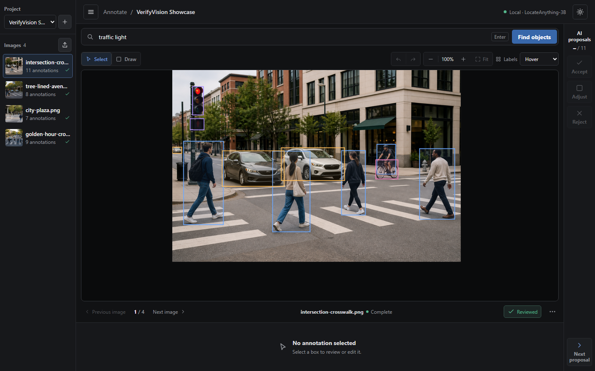
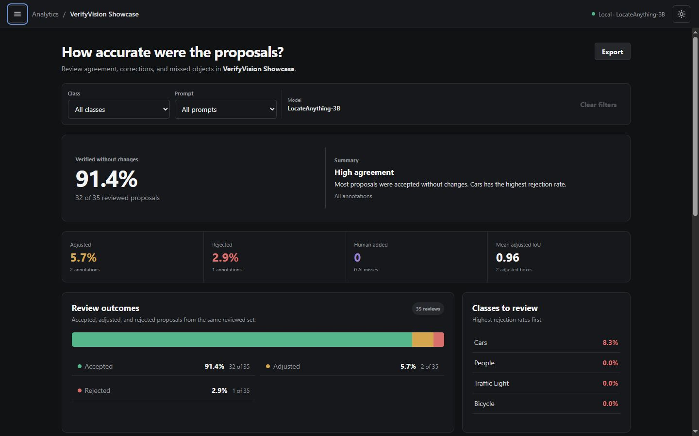
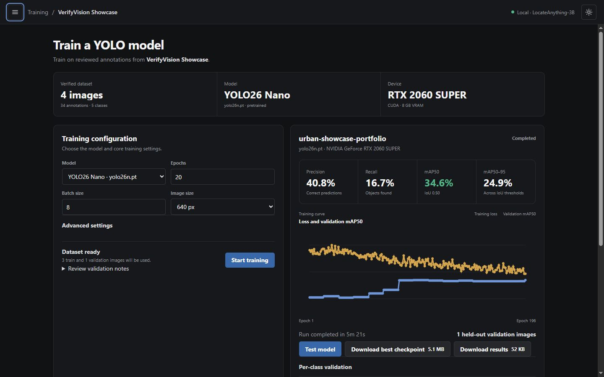

# VerifyVision

VerifyVision is a local tool for building and checking object-detection datasets with [NVIDIA LocateAnything-3B](https://huggingface.co/nvidia/LocateAnything-3B). Tell it what to find in an image, review the boxes it suggests, then export the dataset or train a YOLO model from it.

Inference, training, projects, and exports stay on the local machine.



## What it does

- Prompt-based object localization with LocateAnything-3B
- Human review and editing with original model proposals preserved
- Dataset analytics for annotation quality and model performance
- YOLO, COCO, Pascal VOC, and Evaluation CSV export
- Local YOLO training and checkpoint testing

## Getting started

- 64-bit Windows or Linux
- NVIDIA GPU with CUDA
- Python 3.12
- Node.js, npm, and Git

**macOS, AMD GPUs, and CPU-only inference aren't supported.**

### Windows

```powershell
git clone https://github.com/hsteven0/verify-vision.git VerifyVision
cd VerifyVision
.\verifyvision.ps1 all
```

After setup, double-click `VerifyVision.exe` or run `.\verifyvision.ps1 start`.

### Linux

```bash
git clone https://github.com/hsteven0/verify-vision.git VerifyVision
cd VerifyVision
chmod +x verifyvision.sh
./verifyvision.sh all
```

On Linux, use `./verifyvision.sh start` after setup. The command launchers also provide `status`, `diagnose`, `stop`, `update`, and `version`. The first LocateAnything request downloads the model.

## Screenshots





## Stack

- **Frontend:** React, TypeScript, Vite
- **Backend:** Python, FastAPI
- **ML:** PyTorch, CUDA, LocateAnything-3B, Ultralytics YOLO

## Development

```powershell
.\.venv\Scripts\python.exe -m pytest backend\tests -q
npm --prefix frontend test
npm --prefix frontend run lint
npm --prefix frontend run typecheck
npm --prefix frontend run build
```

On Linux, use `./.venv/bin/python` for the backend command.
Rebuild the Windows launcher with `.\scripts\windows-launcher\build.ps1`.

## Credits

- [NVIDIA LocateAnything-3B](https://huggingface.co/nvidia/LocateAnything-3B) — object localization
- [NVIDIA Eagle](https://github.com/NVlabs/Eagle) — LocateAnything implementation
- [Ultralytics YOLO](https://github.com/ultralytics/ultralytics) — detector training and testing

LocateAnything-3B is provided under NVIDIA's non-commercial license.

## License

VerifyVision is licensed under the [GNU AGPL v3.0](LICENSE).
